# Diagrama de Componentes - Visão Geral (Nível 1)

Este diagrama mostra a visão de alto nível da arquitetura do Kael, focando nas camadas principais e seus relacionamentos.

## Arquitetura Single-Process

O Kael opera como um processo Node.js único que unifica todos os componentes, sem overhead de IPC entre serviços.

```mermaid
graph TB
    subgraph "External Clients"
        CLI[CLI<br/>tsx src/cli/index.ts]
        API[API Clients<br/>curl / Postman / Web]
        Discord[Discord Bot<br/>discord-bot command]
        Email[Email<br/>Gmail POP3/SMTP]
    end

    subgraph "Kael Process - Single Runtime"
        subgraph "Gateway Layer"
            Fastify[Fastify Server<br/>HTTP + WebSocket<br/>src/api/server.ts]
        end

        subgraph "Orchestration Layer"
            Chat[ChatService<br/>src/chat/service.ts]
            Auto[AutomationService<br/>src/automation/service.ts]
            Scheduler[PersistentScheduler<br/>src/automation/scheduler/persistent-scheduler.ts]
            Heartbeat[HeartbeatRunner<br/>src/automation/heartbeat-runner.ts]
        end

        subgraph "Domain Services Layer"
            Agents[Agents<br/>Simple/PI/Hybrid<br/>src/agents/]
            Memory[MemoryService<br/>src/memory/service.ts]
            Planner[PlannerService<br/>src/planner/service.ts]
            Research[ResearchService<br/>src/research/service.ts]
            Video[Video Capability<br/>src/capabilities/video/]
            Shell[ShellToolService<br/>src/tools/system/]
            Media[MediaUnderstandingService<br/>src/media/service.ts]
            EmailIngest[EmailIngestService<br/>src/email/ingest-service.ts]
        end

        subgraph "Storage Layer"
            Session[SessionStore<br/>JSONL transcripts<br/>src/session/store.ts]
            Jobs[JobStore<br/>JSON persistence<br/>src/jobs/store.ts]
            MemoryStore[Memory Store<br/>MEMORY.md + daily<br/>src/memory/service.ts]
            PlanStore[Plan Store<br/>plans.json<br/>src/planner/service.ts]
            ResearchCache[Research Cache<br/>fetch-cache.json<br/>src/research/service.ts]
            EmailState[Email State<br/>gmail-pop3-state.json<br/>src/email/]
            SchedulerState[Scheduler State<br/>scheduler-jobs.json<br/>src/automation/]
            KaelConfig[Kael Config<br/>~/.kael/config.json<br/>src/config.ts]
            DataDir[Data Directory<br/>./.kael-data/<br/>src/global-config.ts]
        end

        subgraph "External Dependencies"
            PiSDK[PI Agent SDK]
            OpenAI[OpenAI API<br/>GPT-4o]
            Tavily[Tavily Search API]
            Gmail[Gmail<br/>POP3 + SMTP]
        end
    end

    %% External to Gateway
    CLI -->|chat command| Fastify
    API -->|POST /chat, GET /health| Fastify
    Discord -->|messages| Chat
    Email -->|polling POP3| EmailIngest

    %% Gateway to Orchestration
    Fastify -->|chat requests| Chat
    Fastify -->|jobs queries| Jobs
    Fastify -->|health/telemetry| Auto

    %% Orchestration to Domain Services
    Chat -->|engine turn| Engine
    Chat -->|memory operations| Memory
    Chat -->|planning| Planner
    Chat -->|web search| Research
    Chat -->|video tools| Video
    Chat -->|shell commands| Shell
    Chat -->|media understanding| Media
    Chat -->|email ingest| EmailIngest

    %% Automation
    Auto -->|heartbeat| Heartbeat
    Auto -->|scheduler| Scheduler
    Scheduler -->|periodic jobs| Heartbeat
    Scheduler -->|reconciliation| Planner
    Scheduler -->|email poll| EmailIngest

    %% Domain Services to Storage
    Chat -->|persist/read| Session
    Engine -->|persist| Jobs
    Video -->|persist| Jobs
    Planner -->|persist/load| PlanStore
    Research -->|cache| ResearchCache
    EmailIngest -->|state| EmailState
    Memory -->|write/read| MemoryStore
    Scheduler -->|persist/load| SchedulerState

    %% Storage to Config
    Session -->|dataDir| DataDir
    Jobs -->|dataDir| DataDir
    MemoryStore -->|kaelHome| KaelConfig
    ResearchCache -->|dataDir| DataDir
    EmailState -->|dataDir| DataDir
    SchedulerState -->|dataDir| DataDir
    Config -->|load| KaelConfig

    %% External Dependencies
    Engine -->|AI runtime| PiSDK
    Media -->|vision/audio| OpenAI
    Research -->|search| Tavily
    EmailIngest -->|fetch/reply| Gmail
    Email -->|auto-reply SMTP| Gmail

    %% Styling
    classDef gateway fill:#e1f5ff,stroke:#01579b,stroke-width:2px
    classDef orchestration fill:#fff3e0,stroke:#e65100,stroke-width:2px
    classDef domain fill:#f3e5f5,stroke:#4a148c,stroke-width:2px
    classDef storage fill:#e8f5e9,stroke:#1b5e20,stroke-width:2px
    classDef external fill:#ffebee,stroke:#b71c1c,stroke-width:2px
    classDef dependency fill:#f5f5f5,stroke:#616161,stroke-width:1px

    class Fastify gateway
    class Chat,Auto,Scheduler,Heartbeat orchestration
    class Engine,Memory,Planner,Research,Video,Shell,Media,EmailIngest domain
    class Session,Jobs,MemoryStore,PlanStore,ResearchCache,EmailState,SchedulerState,KaelConfig,DataDir storage
    class CLI,API,Discord,Email external
    class PiSDK,OpenAI,Tavily,Gmail dependency
```

## Camadas e Responsabilidades

### Gateway Layer
- **Fastify Server**: Entry point HTTP/WebSocket, expõe endpoints REST (`/chat`, `/health`, `/jobs`, `/plans`) e endpoints de observabilidade.

### Orchestration Layer
- **ChatService**: Orquestrador principal de conversas, gerencia roteamento, pré-processamento multimodal, persistência de mensagens e recuperação de erros.
- **AutomationService**: Coordena automação periódica (heartbeat, scheduler, reconciliation).
- **PersistentScheduler**: Job scheduler persistente com suporte a intervalo e cron, com catch-up após restart.
- **HeartbeatRunner**: Executa verificações periódicas proativas (jobs, emails, etc.) com contrato `HEARTBEAT_OK`.

### Domain Services Layer
- **Engine**: Runtime de agente (Simple, PI, Hybrid) que interpreta mensagens e executa tool calls.
- **MemoryService**: Memória persistente de longo prazo (MEMORY.md) e diária, com busca e escrita.
- **PlannerService**: Planejamento de tarefas multi-etapa com estado persistido e reconciliação automática.
- **ResearchService**: Pesquisa web com citações, cache por URL e suporte a múltiplos providers (Tavily).
- **VideoJobService**: Execução assíncrona de jobs de vídeo (transcode, HLS, capture, probe, VLC).
- **ShellToolService**: Execução segura de comandos shell com timeout, sessões em background e approvals.
- **MediaUnderstandingService**: Entendimento multimodal (descrição de imagem, transcrição de audio).
- **EmailIngestService**: Ingest de emails via provider desacoplado (Gmail POP3) com dedupe e auto-reply SMTP.

### Storage Layer
- **SessionStore**: Transcripts JSONL append-only por sessão, eficiente para streaming.
- **JobStore**: Jobs persistentes em JSON com logs dedicados.
- **Memory Store**: Memória curada (MEMORY.md) e diária (memory/YYYY-MM-DD.md).
- **Plan Store**: Planos persistidos com steps e status.
- **Research Cache**: Cache de fetch por URL com TTL.
- **Email State**: Estado de mensagens vistas por UID (POP3).
- **Scheduler State**: Jobs persistidos com catch-up após restart.
- **Kael Config**: Configuração global em ~/.kael/config.json.
- **Data Directory**: ./data/ para persistência de runtime (padrão ./kael-data/).

## Padrões Chave

### Single-Process Gateway
- Todos os componentes rodam no mesmo processo Node.js.
- Zero overhead de IPC entre serviços.
- State sharing via memória compartilhada direta.
- Simplicidade de deployment.

### Contratos Desacoplados
- **AgentEngine**: Interface única para diferentes engines (Simple/PI/Hybrid).
- **EmailProvider**: Provider de email plugável (Gmail POP3 hoje, Pub/Sub futuro).
- **ShellRuntime**: Abstração para execução de shell com approvals.
- **MediaUnderstandingService**: Provider plugável para multimodal (OpenAI hoje, outros no futuro).

### Persistência Simples
- JSONL para transcripts (append-only, streaming-friendly).
- JSON para jobs/state/plans.
- Arquivos markdown para memória (human-readable).
- Cache em JSON com TTL.

## Fases Atuais

- **Fase 14** (em andamento): Email ingress MVP via provider desacoplado + polling POP3.
- **Fase 15** (em andamento): Multimodal ingress MVP (imagem/audio entrada/saída).

## Documentação Relacionada

- [Componentes Detalhados (Nível 2)](detailed-components.md)
- [Sequência de Chat Principal](sequence-chat-flow.md)
- [Fases do Projeto](../phases/)
