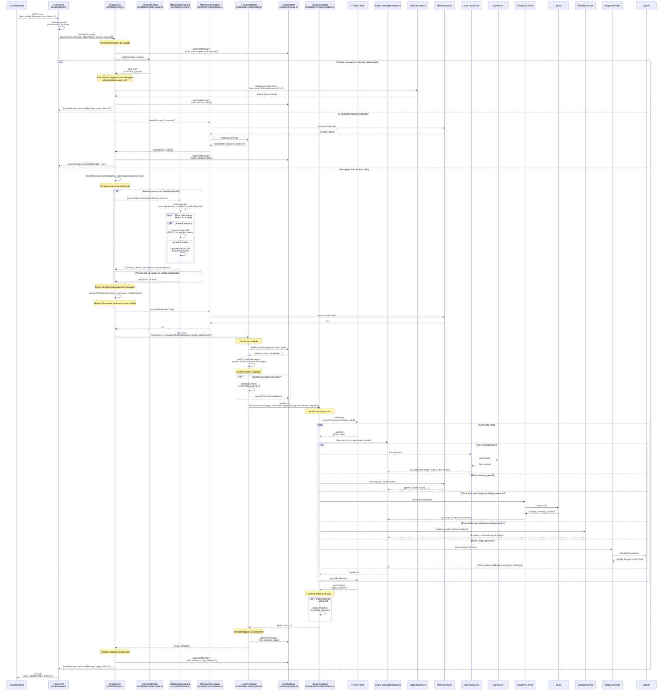

# Diagrama de Sequência - Fluxo de Chat Principal

Este diagrama mostra o fluxo detalhado de uma mensagem de chat desde a entrada via API até a resposta, incluindo o pipeline multimodal e a persistência.

## Fluxo Principal

## Fluxo por Etapa

### 1. Recebimento da Mensagem
1. Cliente faz `POST /chat` com `{sessionKey, message, attachments?, source?, requestId?}`
2. API valida payload (incluindo idempotency signature com attachments)
3. ChatService persiste mensagem do usuário no transcript JSONL

### 2. Roteamento (CommandRouter)
- **Slash commands** → Fast-path via SimpleCommandEngine (determinístico)
- **Comando especial `/compact`** → MemoryOrchestrator (flush + compactação)
- **Mensagem livre ou chat-only** → Fluxo completo com PI Engine

### 3. Pré-processamento Multimodal
**Se anexos presentes e media habilitado:**
1. MediaUnderstandingService aplica budget (maxAttachments, maxBytes, maxPerSource)
2. Para cada anexo dentro do budget:
   - Imagem → OpenAI vision API (GPT-4o) para descrição
   - Audio → OpenAI Whisper API para transcrição
3. Injeta bloco `[media_context]` na mensagem do usuário

**Caso contrário:**
- Anexos fora do budget ou media desabilitado → Omite contexto multimodal

### 4. Memory Flush (Pré-turno)
- MemoryOrchestrator faz flush de memória diária antes do turno (se necessário)
- Evita perda de memória em caso de timeout/erro do turno

### 5. Turn Orchestration
**Gestão de contexto:**
1. Recupera mensagens recentes (maxMessages)
2. Constroi contextMessages (system prompt + recent messages)
3. Verifica context overflow:
   - Se excede maxChars → Compacta contexto (LLM-guided summary)
   - Persiste marcador de compaction no transcript

### 6. Engine Turn (PI Agent SDK)
**Tool calling loop:**
1. PI SDK executa agente com system prompt (SOUL.md)
2. Agente decide se precisa chamar tools
3. Para cada tool call:
   - Engine executa via `EngineToolingNamespaces`
   - Tooling despacha para service apropriado
   - Resultado retornado ao PI SDK
4. Loop continua até agente decidir finalizar
5. PI SDK retorna reply + artifacts (se aplicável)

### 7. Persistência e Resposta
1. TurnOrchestrator persiste resposta do assistente
2. ChatService persiste no transcript com artifacts (se aplicável)
3. API retorna `{user, assistant, reply, artifacts?}`

## Casos Especiais

### Fast-Path de Slash Commands
Comandos operacionais são roteados diretamente sem passar pelo LLM:
- `/jobs`, `/probe`, `/transcode`, `/convertHLS`, `/captureStream`, `/playVLC`
- Reduz latência e custo de API

### Compactação de Contexto
Quando contexto excede limite:
- TurnOrchestrator compacta via LLM-guided summary
- Mantém mensagens importantes + resumo
- Registra marcador de compaction no transcript

### Timeout do Turn
Se PI SDK timeout:
- ChatService retorna fallback com evidências parciais
- Inclui resumo de tools executadas (web_search/web_fetch/web_research)
- Mensagem de erro amigável

### Memory Flush Diário
Antes do turno, se necessário:
- MemoryOrchestrator faz flush de memória diária
- Persiste em `memory/YYYY-MM-DD.md`
- Permite recuperação de memória futura

### Artifacts Multimodais
Tools podem emitir artifacts (ex: `image_generate`):
1. PiEngineAdapter coleta artifacts emitidos por tools
2. Retorna artifacts no `EngineTurnOutput`
3. ChatService expõe na resposta API
4. Email reply anexa artifacts (imagem gerada)

## Telemetria

### ChatRoutingTelemetry
- `fast_path`: Turnos roteados via fast-path
- `llm_turn`: Turnos processados via LLM
- `compact`: Turnos com compactação de contexto

### MediaRuntimeTelemetry
- `processedAttachments`: Anexos processados
- `skippedTooLarge`: Anexos muito grandes
- `skippedBySourceLimit`: Anexos fora do limite por origem
- `skippedByTotalBytesBudget`: Anexos fora do limite total
- `skippedByProcessingBudget`: Anexos fora do limite de processamento
- `imageDescribed`: Imagens descritas
- `audioTranscribed`: Audios transcritos
- `failures`: Falhas no processamento multimodal

### EngineRuntimeTelemetry
- `timeouts`: Total de timeouts
- `toolCallsByName`: Contador de chamadas por tool
- `blockedCallsByTool`: Contador de chamadas bloqueadas (loop guard)

## Documentação Relacionada

- [Visão Geral de Componentes (Nível 1)](overview-components.md)
- [Componentes Detalhados (Nível 2)](detailed-components.md)
- [Fase 11: Reply Orchestrator Lite](../phases/phase-11.md)
- [Fase 15: Multimodal Ingress MVP](../phases/phase-15.md)
