# Fluxo do `handleMessage` - ChatService

Este diagrama mostra o fluxo completo de execução do método `handleMessage` em `src/chat/service.ts`, desde a chamada inicial até a resposta final.

## Legenda

- **alt**: Caminhos alternativos (condicionais)
- **loop**: Repetições
- **opt**: Blocos opcionais
- **par**: Execução paralela

## Diagrama de Sequência

```mermaid
sequenceDiagram
    autonumber
    participant Client as Cliente
    participant ChatService as ChatService
    participant SessionStore as SessionStore
    participant MemoryOrchestrator as MemoryOrchestrator
    participant TurnOrchestrator as TurnOrchestrator
    participant AgentEngine as AgentEngine<br/>(Pi/Simple)
    participant Tools as Tools<br/>(Jobs, Shell, Memory...)
    participant SimpleEngine as SimpleCommandEngine

    %% Início do fluxo
    Client->>ChatService: handleMessage({ sessionKey, message })
    ChatService->>ChatService: handleMessageInternal(tooling, allowPlayVlcShortcut=true)
    
    %% Salvar mensagem do usuário
    ChatService->>SessionStore: appendMessage(sessionKey, "user", message)
    SessionStore-->>ChatService: user: SessionMessage

    %% Verificar comando de compactação manual
    alt É comando de compactação? (/compact)
        ChatService->>MemoryOrchestrator: isCompactCommand(message)
        MemoryOrchestrator-->>ChatService: true
        
        ChatService->>ChatService: handleCompactCommand()
        ChatService->>MemoryOrchestrator: runManualCompact()
        MemoryOrchestrator->>MemoryOrchestrator: flushSessionToDailyMemory()
        par LLM Flush (tentativa)
            MemoryOrchestrator->>TurnOrchestrator: runUtilityTurn()
            TurnOrchestrator->>AgentEngine: runTurn()
            AgentEngine->>Tools: memoryWrite()
            Tools-->>AgentEngine: result
            AgentEngine-->>TurnOrchestrator: turn
            TurnOrchestrator-->>MemoryOrchestrator: result
        and Heuristic Fallback
            MemoryOrchestrator->>Tools: memory.write(heuristic)
        end
        MemoryOrchestrator->>MemoryOrchestrator: promoteLongTermMemoryIfNeeded()
        MemoryOrchestrator->>TurnOrchestrator: runUtilityTurn()
        TurnOrchestrator->>AgentEngine: runTurn()
        AgentEngine->>Tools: memory.write()
        Tools-->>AgentEngine: result
        AgentEngine-->>TurnOrchestrator: turn
        TurnOrchestrator-->>MemoryOrchestrator: result
        MemoryOrchestrator->>TurnOrchestrator: compactNow()
        TurnOrchestrator->>TurnOrchestrator: compactContext(apply=true)
        TurnOrchestrator->>TurnOrchestrator: summarizeForCompaction()
        TurnOrchestrator->>SessionStore: appendMessage("system", "[compaction]")
        TurnOrchestrator-->>MemoryOrchestrator: compaction result
        MemoryOrchestrator-->>ChatService: { flush, promote, compaction }
        ChatService-->>ChatService: reply = compactação executada
    else Não é comando de compactação
        
        %% Verificar se é slash command
        alt É slash command? (permite fast-path)
            ChatService->>ChatService: isSlashCommand(message)
            ChatService-->>ChatService: true (permite SimpleCommandEngine)
            
            ChatService->>SimpleEngine: runTurn({ message, tooling })
            alt Comando /help
                SimpleEngine-->>ChatService: reply = lista de comandos
            else Comando /jobs
                SimpleEngine->>Tools: listJobs()
                Tools-->>SimpleEngine: jobs list
                SimpleEngine-->>ChatService: reply = lista de jobs
            else Comando /transcode
                SimpleEngine->>Tools: startTranscode()
                Tools-->>SimpleEngine: job
                SimpleEngine-->>ChatService: reply = transcode iniciado
            else Comando /hls
                SimpleEngine->>Tools: startConvertHls()
                Tools-->>SimpleEngine: job
                SimpleEngine-->>ChatService: reply = HLS iniciado
            else Comando /capture
                SimpleEngine->>Tools: startCaptureStream()
                Tools-->>SimpleEngine: job
                SimpleEngine-->>ChatService: reply = capture iniciado
            else Comando /probe
                SimpleEngine->>Tools: startProbeMedia()
                Tools-->>SimpleEngine: job
                SimpleEngine-->>ChatService: reply = probe iniciado
            else Comando desconhecido
                SimpleEngine-->>ChatService: reply = use /help
            end
        else Mensagem natural (usa Pi/hybrid engine)
            ChatService->>MemoryOrchestrator: runAutoCompactionWithMemoryFlushIfNeeded()
            MemoryOrchestrator->>TurnOrchestrator: checkCompactionNeed()
            TurnOrchestrator->>TurnOrchestrator: compactContext(apply=false)
            alt Precisa compactar?
                MemoryOrchestrator-->>ChatService: compaction_needed
                Note over MemoryOrchestrator: Executa flush + promote + compaction
                MemoryOrchestrator->>MemoryOrchestrator: flushSessionToDailyMemory()
                MemoryOrchestrator->>MemoryOrchestrator: promoteLongTermMemoryIfNeeded()
                MemoryOrchestrator->>TurnOrchestrator: compactNow()
                TurnOrchestrator->>SessionStore: appendMessage("system", "[compaction]")
                TurnOrchestrator-->>MemoryOrchestrator: result
                MemoryOrchestrator-->>ChatService: void (silencioso)
            else Não precisa compactar
                MemoryOrchestrator-->>ChatService: void
            end
            
            %% Executar turno principal
            ChatService->>TurnOrchestrator: run({ message, tooling })
            TurnOrchestrator->>SessionStore: getMessages(sessionKey, limit)
            SessionStore-->>TurnOrchestrator: history[]
            TurnOrchestrator->>TurnOrchestrator: buildContextMessages()
            Note over TurnOrchestrator: Filtra mensagens<br/>Limita por count + chars<br/>Remove duplicata da atual
            TurnOrchestrator->>AgentEngine: runTurn({ contextMessages, message, tooling })
            
            %% AgentEngine processa com tools
            loop Chamadas de tools (se necessário)
                AgentEngine->>Tools: [tool]调用
                Tools-->>AgentEngine: result
            end
            AgentEngine-->>TurnOrchestrator: turn: { reply }
            TurnOrchestrator-->>ChatService: turn: { reply }
            
            %% Verificar shortcut VLC
            opt Resposta contém /playvlc URL
                ChatService->>ChatService: extractPlayVlcUrl(turn.reply)
                ChatService-->>ChatService: url
                
                ChatService->>Tools: execCommand({ command: "vlc <url>", background=true })
                Tools-->>ChatService: exec result
                Note over ChatService: Modifica reply para<br/>mostrar execução do VLC
            end
        end
    end

    %% Salvar resposta do assistente
    ChatService->>SessionStore: appendMessage(sessionKey, "assistant", reply)
    SessionStore-->>ChatService: assistant: SessionMessage

    %% Tratamento de erros
    alt Erro durante execução?
        ChatService->>ChatService: normalizePiError(error)
        
        alt Erro é timeout?
            ChatService-->>ChatService: code="timeout"
            ChatService->>Tools: processCommand({ action: "list" })
            Tools-->>ChatService: sessions list
            Note over ChatService: Constrói resposta informativa<br/>com últimas sessões shell
        else Erro irrecuperável? (invalid_response / unknown)
            ChatService-->>ChatService: precisa resetar
            ChatService->>SessionStore: resetSession(sessionKey)
            SessionStore-->>ChatService: session resetada
            
            ChatService->>SessionStore: appendMessage(sessionKey, "user", message)
            SessionStore-->>ChatService: user: SessionMessage
            
            ChatService->>TurnOrchestrator: run({ message, tooling })
            TurnOrchestrator->>SessionStore: getMessages()
            TurnOrchestrator->>TurnOrchestrator: buildContextMessages()
            TurnOrchestrator->>AgentEngine: runTurn()
            AgentEngine-->>TurnOrchestrator: turn
            TurnOrchestrator-->>ChatService: turn
            
            ChatService->>SessionStore: appendMessage(sessionKey, "assistant", turn.reply)
            SessionStore-->>ChatService: assistant: SessionMessage
        else Outro erro
            ChatService->>ChatService: throw error
        end
    end

    %% Retorno final
    ChatService-->>Client: { user, assistant, reply }
```

## Descrição dos Fluxos

### 1. Fluxo Principal (Mensagem Natural)

Quando o usuário envia uma mensagem que **não** é um comando, o fluxo é:

1. **Auto-compaction**: Verifica se o histórico está muito grande. Se sim, executa:
   - Flush para memória diária (via LLM ou heurística)
   - Promoção para memória de longo prazo (via LLM)
   - Compactação do contexto (resumo de mensagens antigas)

2. **Build Context**: Constrói o contexto de mensagens para enviar ao LLM, respeitando limites de quantidade e caracteres

3. **Engine Execution**: Executa o turno através do AgentEngine (Pi/hybrid), que pode chamar tools múltiplas vezes

4. **VLC Shortcut**: Se a resposta contiver `/playvlc <url>`, executa o VLC automaticamente

### 2. Fluxo de Slash Command (Fast-path)

Para comandos começados com `/`, há um fast-path determinístico que não depende do LLM:

- `/help`: Lista comandos disponíveis
- `/jobs`: Lista jobs ativos
- `/transcode`: Inicia job de transcode
- `/hls`: Inicia job de HLS
- `/capture`: Inicia job de captura de stream
- `/probe`: Inicia job de probe

### 3. Fluxo de Compact Command

O comando `/compact` executa manualmente as operações de gerenciamento de memória:

- Flush para memória diária
- Promoção para memória de longo prazo
- Compactação do contexto

### 4. Tratamento de Erros

- **Timeout**: Lista as últimas execuções shell para ajudar o usuário a entender o que aconteceu
- **Erro irrecuperável**: Reseta a sessão e tenta novamente (uma vez) sem o histórico antigo
- **Outros erros**: Propaga o erro normalmente

## Referências de Código

- `src/chat/service.ts:212` - `handleMessage()`
- `src/chat/service.ts:228` - `handleMessageInternal()`
- `src/chat/turn-orchestrator.ts:78` - `TurnOrchestrator.run()`
- `src/memory/orchestrator.ts:56` - `runAutoCompactionWithMemoryFlushIfNeeded()`
- `src/engine/simple-engine.ts:36` - `SimpleCommandEngine.runTurn()`
- `src/engine/pi-engine-adapter.ts` - PiEngineAdapter (engine baseada em LLM)
