# Mecanismo de Compactação e Memória

Este diagrama mostra o fluxo completo de gerenciamento de memória do Kael, incluindo compactação de contexto, flush de memória diária e promoção de memória de longo prazo.

## Visão Geral

O sistema de memória do Kael opera em **três níveis**:

1. **Contexto de Sessão (Short-term)**: Histórico recente de conversação, gerenciado via compactação
2. **Memória Diária (Medium-term)**: Resumos diários armazenados em `memory/YYYY-MM-DD.md`
3. **Memória de Longo Prazo (Long-term)**: Fatos duráveis em `MEMORY.md` (preferências, identidade, ambiente)

## Legenda

- **par**: Execução em paralelo (tentativas alternativas)
- **alt**: Caminhos alternativos (condicionais)
- **opt**: Blocos opcionais

## Diagrama de Sequência

```mermaid
sequenceDiagram
    autonumber
    participant Client as Cliente
    participant ChatService as ChatService
    participant MemOrch as MemoryOrchestrator
    participant TurnOrch as TurnOrchestrator
    participant SessionStore as SessionStore
    participant MemService as MemoryService
    participant AgentEngine as AgentEngine
    participant Tools as Tools

    %% Início: comando manual /compact
    alt Comando /compact (manual)
        Client->>ChatService: handleMessage("/compact")
        ChatService->>MemOrch: runManualCompact()
        
        Note over MemOrch: Executa flush + promote + compaction<br/>(sempre forçado)
    else Mensagem normal (automático)
        Client->>ChatService: handleMessage(message)
        ChatService->>MemOrch: runAutoCompactionWithMemoryFlushIfNeeded()
        
        Note over MemOrch: Verifica se precisa compactar
        MemOrch->>TurnOrch: checkCompactionNeed()
        TurnOrch->>TurnOrch: compactContext(apply=false)
        TurnOrch->>SessionStore: getMessages(fetchLimit)
        SessionStore-->>TurnOrch: history[]
        
        alt Tem compactação recente?
            TurnOrch-->>MemOrch: recent_compaction
            Note over MemOrch: Retorna sem fazer nada
        else Atingiu threshold (mensagens/chars)?
            TurnOrch-->>MemOrch: compaction_needed
        else Não atingiu threshold?
            TurnOrch-->>MemOrch: below_threshold
            Note over MemOrch: Retorna sem fazer nada
        end
    end

    %% Se precisa compactar (manual ou auto)
    alt Precisa compactar
        Note over MemOrch: Passo 1: Flush para memória diária
        MemOrch->>MemOrch: flushSessionToDailyMemory()
        
        par Tentativa via LLM
            MemOrch->>MemService: readMemorySnapshot(memory/today.md)
            MemService-->>MemOrch: { length }
            
            MemOrch->>TurnOrch: runTurnWithExcludedMessage()
            Note over TurnOrch: message = buildMemoryFlushPrompt()<br/>excludeCurrentMessage = mensagem atual
            
            TurnOrch->>TurnOrch: buildContextMessages()
            TurnOrch->>AgentEngine: runTurn({ message, tooling, contextMessages })
            
            Note over AgentEngine: LLM decide o que salvar<br/>Pode usar memory_write(target='daily')
            AgentEngine->>Tools: memory_write(target='daily', content)
            Tools->>MemService: write({ target: 'daily', content })
            MemService->>MemService: Escreve em memory/YYYY-MM-DD.md
            MemService-->>Tools: { path, written }
            Tools-->>AgentEngine: result
            AgentEngine-->>TurnOrch: turn
            TurnOrch-->>MemOrch: result
            
            MemOrch->>MemService: readMemorySnapshot(memory/today.md)
            MemService-->>MemOrch: { length }
            
            alt Arquivo cresceu?
                MemOrch-->>MemOrch: written=true (llm_flush)
            else Erro no LLM?
                Note over MemOrch: Fallback para heurística
            end
        and Fallback heurístico (se LLM falhar)
            MemOrch->>SessionStore: getMessages(sessionKey, 80)
            SessionStore-->>MemOrch: history[]
            
            MemOrch->>MemOrch: buildHeuristicDailyFlushNote()
            Note over MemOrch: Cria resumo das últimas 12 mensagens<br/>Formato: [manual-compact] Resumo heurístico
            
            alt Histórico suficiente?
                MemOrch->>MemService: write({ target: 'daily', content: note })
                MemService-->>MemOrch: { path, written }
                MemOrch-->>MemOrch: written=true (heuristic_fallback)
            else Histórico insuficiente
                MemOrch-->>MemOrch: written=false (not_enough_conversation)
            end
        end
        
        Note over MemOrch: Passo 2: Promoção para memória de longo prazo
        MemOrch->>MemOrch: promoteLongTermMemoryIfNeeded()
        
        MemOrch->>MemService: readMemorySnapshot(MEMORY.md)
        MemService-->>MemOrch: { length }
        
        MemOrch->>TurnOrch: runTurnWithExcludedMessage()
        Note over TurnOrch: message = buildLongTermPromotionPrompt()<br/>excludeCurrentMessage = mensagem atual
        
        TurnOrch->>TurnOrch: buildContextMessages()
        TurnOrch->>AgentEngine: runTurn({ message, tooling, contextMessages })
        
        Note over AgentEngine: LLM decide fatos duráveis<br/>Usa memory_search/get para evitar duplicatas
        AgentEngine->>Tools: memory_search(query)
        Tools->>MemService: search({ query })
        MemService-->>Tools: results[]
        Tools-->>AgentEngine: results
        
        opt Tem fatos duráveis para promover?
            AgentEngine->>Tools: memory_write(target='long_term', content)
            Tools->>MemService: write({ target: 'long_term', content })
            MemService->>MemService: Escreve em MEMORY.md
            MemService-->>Tools: { path, written }
            Tools-->>AgentEngine: result
        end
        AgentEngine-->>TurnOrch: turn
        TurnOrch-->>MemOrch: result
        
        MemOrch->>MemService: readMemorySnapshot(MEMORY.md)
        MemService-->>MemOrch: { length }
        
        alt Arquivo cresceu?
            MemOrch-->>MemOrch: written=true (llm_promote)
        else Sem mudanças
            MemOrch-->>MemOrch: written=false (no_change)
        end
        
        Note over MemOrch: Passo 3: Compactação de contexto
        MemOrch->>TurnOrch: compactNow()
        TurnOrch->>TurnOrch: compactContext(apply=true)
        TurnOrch->>SessionStore: getMessages(fetchLimit)
        SessionStore-->>TurnOrch: history[]
        
        alt Tem compactação recente?
            TurnOrch-->>TurnOrch: recent_compaction
        else Atingiu threshold?
            TurnOrch-->>TurnOrch: deve compactar
            
            TurnOrch->>TurnOrch: Calcula mensagens antigas
            Note over TurnOrch: keepRecent = max(maxContextMessages, 12)<br/>older = history[0..length-keepRecent]
            
            alt Tem mensagens antigas suficientes (≥6)?
                TurnOrch->>TurnOrch: summarizeForCompaction(older)
                Note over TurnOrch: Cria resumo:<br/>- Janela de tempo<br/>- Nº de mensagens<br/>- Snippets das 16 mais recentes
                
                TurnOrch->>SessionStore: appendMessage("system", "[compaction]\\n{summary}")
                SessionStore-->>TurnOrch: message
                
                TurnOrch-->>MemOrch: { compacted: true, summarizedMessages, reason: "compacted" }
            else Poucas mensagens antigas
                TurnOrch-->>MemOrch: { compacted: false, reason: "not_enough_older" }
            end
        else Abaixo do threshold
            TurnOrch-->>MemOrch: { compacted: false, reason: "below_threshold" }
        end
        
        Note over MemOrch: Log do resultado completo
        MemOrch->>MemOrch: kaelLogger.info("chat.compact.auto.finished")
        Note over MemOrch: - flushWritten, flushReason, flushPath<br/>- longTermWritten, longTermReason<br/>- compactionApplied, compactionReason<br/>- summarizedMessages
        
        alt É manual (/compact)?
            MemOrch-->>ChatService: { flush, promote, compaction }
            ChatService-->>Client: reply = compactação executada
        else É automático
            MemOrch-->>ChatService: void (silencioso)
        end
    end
    
    %% Continuação do fluxo normal após auto-compaction
    alt Mensagem normal e não precisa compactar
        ChatService->>TurnOrch: runConversationTurn({ message, tooling })
        TurnOrch->>TurnOrch: buildContextMessages()
        TurnOrch->>AgentEngine: runTurn()
        AgentEngine-->>TurnOrch: turn
        TurnOrch-->>ChatService: turn
        ChatService->>SessionStore: appendMessage("assistant", reply)
        SessionStore-->>ChatService: assistant
        ChatService-->>Client: { user, assistant, reply }
    end
```



## Descrição Detalhada

### 1. Verificação de Necessidade de Compactação

O sistema verifica automaticamente se o contexto precisa de compactação:

**Thresholds de Compactação:**
- **Mensagens**: `max( maxContextMessages × 3, maxContextMessages + 12 )`
- **Caracteres**: `max( maxContextChars × 3, maxContextChars + 4000 )`

**Causas de não compactar:**
- `no_messages`: Sem histórico
- `recent_compaction`: Já há uma mensagem `[compaction]` nas últimas 20 mensagens
- `below_threshold`: Ainda não atingiu os thresholds
- `not_enough_older`: Menos de 6 mensagens antigas para resumir

### 2. Flush de Memória Diária

**Objetivo:** Salvar resumos de conversação em arquivos diários (`memory/YYYY-MM-DD.md`)

**Estratégia 1: Via LLM (Primária)**
- Prompt instrui o LLM a analisar contexto recente e salvar memórias úteis
- Usa `memory_write(target='daily')` para escrever
- Opcionalmente também pode escrever em `long_term` se identificar fatos duráveis
- Fallback para heurística se LLM falhar

**Estratégia 2: Heurística (Fallback)**
- Seleciona últimas 12 mensagens do histórico
- Cria resumo estruturado:
  ```
  [manual-compact] Resumo heurístico de contexto antes da compactação.
  session=<sessionKey>
  janela=<first_timestamp> -> <last_timestamp>
  mensagens=<n>
  trechos:
  - user: <clipped_content>
  - assistant: <clipped_content>
  ...
  ```

### 3. Promoção de Memória de Longo Prazo

**Objetivo:** Promover fatos duráveis para `MEMORY.md`

**Critérios de Promoção:**
- Preferências do usuário
- Identidade/papel do assistente
- Ambiente de trabalho
- Padrões de uso
- Configurações estáveis
- Objetivos persistentes

**Processo:**
1. LLM consulta memória existente com `memory_search/memory_get`
2. Evita duplicatas literais
3. Atualiza fatos existentes em vez de criar novos
4. Usa `memory_write(target='long_term')` apenas se necessário

### 4. Compactação de Contexto

**Objetivo:** Reduzir o histórico de sessão mantendo contexto relevante

**Mensagens mantidas:**
- Recentes: `max(maxContextMessages, 12)` mensagens
- Resumo: Das mensagens antigas (≥6), cria um resumo compacto

**Formato do Resumo:**
```
[compaction]
Resumo automático de contexto antigo para preservar janela de tokens.
Janela resumida: <first_timestamp> -> <last_timestamp>
Mensagens resumidas: <n>
Trechos mais recentes da janela resumida:
- user: <clipped_content>
- assistant: <clipped_content>
...
Use este resumo como contexto histórico; priorize mensagens recentes fora da compaction.
```

**Snippets:** Até 16 snippets de 180 caracteres cada das mensagens mais recentes da janela resumida

### 5. Modos de Execução

**Manual (`/compact`):**
- Sempre executa flush + promote + compaction
- Retorna resposta ao usuário
- Útil para limpar contexto manualmente

**Automático (via `runAutoCompactionWithMemoryFlushIfNeeded`):**
- Verifica necessidade antes de executar
- Executa silenciosamente (sem resposta)
- Dispara automaticamente quando threshold é atingido

## Constantes de Configuração

```typescript
// Multiplicador para threshold de compactação
COMPACTION_THRESHOLD_MULTIPLIER = 3

// Piso mínimo extra para configs pequenos
COMPACTION_MIN_EXTRA_MESSAGES = 12
COMPACTION_MIN_EXTRA_CHARS = 4000

// Mensagens recentes para buscar na compactação
COMPACTION_FETCH_MULTIPLIER = 12

// Mensagens recentes para construir contexto
CONTEXT_FETCH_MULTIPLIER = 4

// Mensagens a manter após compactação
keepRecent = max(maxContextMessages, 12)

// Mínimo de mensagens antigas para compactar
minOlderMessages = 6

// Snippets no resumo de compactação
maxSnippets = 16
snippetMaxLength = 180
```

## Referências de Código

- `src/memory/orchestrator.ts:37` - `runManualCompact()`
- `src/memory/orchestrator.ts:56` - `runAutoCompactionWithMemoryFlushIfNeeded()`
- `src/memory/orchestrator.ts:99` - `flushSessionToDailyMemory()`
- `src/memory/orchestrator.ts:135` - `tryLlmMemoryFlush()`
- `src/memory/orchestrator.ts:184` - `promoteLongTermMemoryIfNeeded()`
- `src/memory/policy.ts:20` - `buildMemoryFlushPrompt()`
- `src/memory/policy.ts:32` - `buildLongTermPromotionPrompt()`
- `src/memory/policy.ts:44` - `buildHeuristicDailyFlushNote()`
- `src/chat/turn-orchestrator.ts:104` - `compactNow()`
- `src/chat/turn-orchestrator.ts:108` - `checkCompactionNeed()`
- `src/chat/turn-orchestrator.ts:162` - `compactContext()`
- `src/chat/turn-orchestrator.ts:263` - `summarizeForCompaction()`
